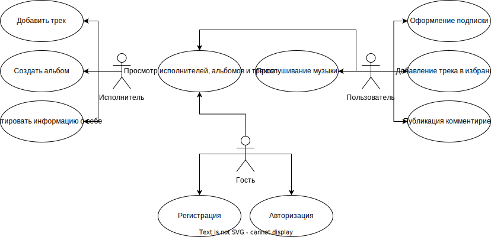
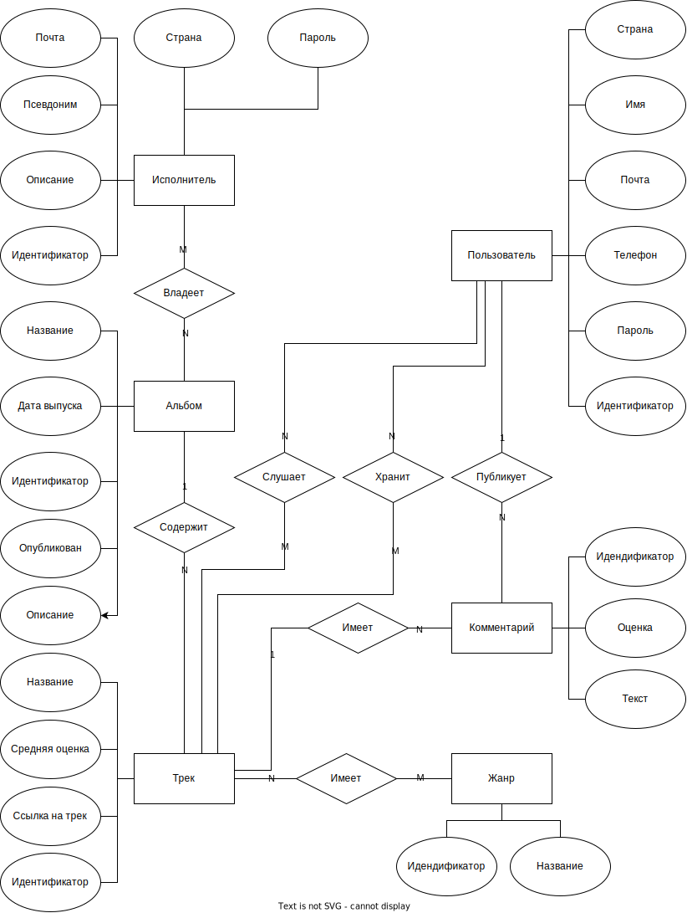
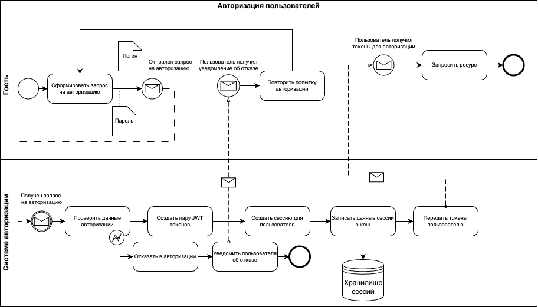

# ППО

## Название проекта
Sigma Music

## Краткое описание идеи проекта
Сервис для прослушивания музыки, позволяет прослушивать музыку пользователям и загружать музыку исполнителям.
Пользователи могут добавлять музыку в избранное и оставлять комментарии. Исполнители загружают создают альбомы и выкладывают музыку.
Чтобы пользователь мог прослушивать музыку без ограничений, ему необходимо преобрести подписку.

## Краткое описание предметной области

Предметная область - музыкальный сервис.

Сервис потоковой передачи музыки - это тип сервиса потокового мультимедиа, который фокусируется в основном на музыке, а иногда и на других формах цифрового аудиоконтента, таких как подкасты.
Такие сервисы обычно являются сервисами на основе подписки.
Некоторые сервисы могут предлагать бесплатные уровни с ограничениями, такими как реклама и ограничения на использование.

## Краткий анализ аналогичных решений по 4 критериям

|Решение|Пользовательский отчет|Доступность оплаты в России|Наличие комментариев|
|---|---|---|---|
|Sigma Music|+|+|+|
|Yandex Music|+|+|-|
|Spotify|+|-|-|
|VK Music|+|+|-|

## Актуальность
Стриминговые сервисы для прослушивания музыки становятся все более популярными среди музыкальных потребителей, их актуальность в настоящее время трудно переоценить. Вместо скачивания отдельных треков или альбомов пользователи могут получить доступ к огромной библиотеке музыки практически любого жанра прямо на своих устройствах.
Одним из главных преимуществ стриминговых сервисов является удобство использования. Пользователи могут слушать музыку на ходу, создавать плейлисты, делиться музыкой с друзьями.
Таким образом, стриминговые сервисы для прослушивания музыки являются удобным, доступным и разнообразным способом наслаждаться любимыми композициями в любое время и в любом месте.

## Описание ролей
**Гость** - неавторизованный пользователь, который может лишь посмотреть информацию об исполнителе, авторизоваться, зарегистрироваться.

**Пользователь** - авторизованный, может может прослушивать музыку без ограничений.

**Исполнитель** - пользователь, который может загружать свои треки.

## Use-Case диаграмма

## ER диаграмма

## Диаграмма базы данных

## Сложные сценарии

#### Формирование отчета
1. Пользователь отправляет запрос на формирование отчета;
2. Формируется упорядоченный список исполнителей, которых слушал пользователь;
3. Формируется список жанров, которые слушал пользователь;
4. Рассчитывается количество прослушиваний пользователем, каждого жанра;
5. Рассчитывается процентное соотношение прослушивания каждого жанра;
6. Вычисляется общее число прослушиваний пользователя;
7. Ответ на запрос возвращается пользователю.

[//]: # (#### Оформление подписки  )

[//]: # (1. Пользователь выбирает план подписки;)

[//]: # (2. Генерируется ссылка для оплаты с параметрами идентификации пользователя и платежа;)

[//]: # (3. Пользователь перенаправляется на страницу оплаты;)

[//]: # (4. Пользователь вводит платежные данные;)

[//]: # (5. Платежная система реализует нужный сценарий подтверждения оплаты &#40;например, перенаправляет пользователя в интернет-банк&#41;;)

[//]: # (6. Пользователь подтверждает оплату;)

[//]: # (7. Возвращает пользователя на страницу завершения оплаты на стороне сервиса.)

#### Авторизация пользователей при входе
1. Пользователь вводит логин и пароль;
2. Создается пара JWT токенов - access токен и refresh токен;
3. Создается новая сессия;
4. Сессия помещается в redis;
5. Пользователю возвращется пара JWT токенов.

## Пользовательские сценарии

**Гость** может:
- просмотреть информацию об исполнителе;
- авторизоваться;
- зарегистрироваться.

После авторизации гость становится *пользователем*.

**Пользователь** может:
- просмотреть информацию об исполнителе;
- прослушивать треки;
- добавлять треки в избранное;
- оставлять комментарии.

**Исполнитель** может:
- загрузить трек;
- создать альбом;
- добавлять информацию о себе;

## BPMN-диаграмма

## Экраны веб приложения

